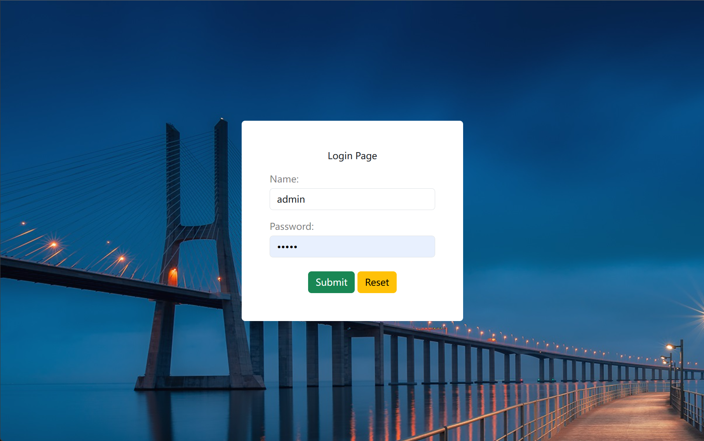
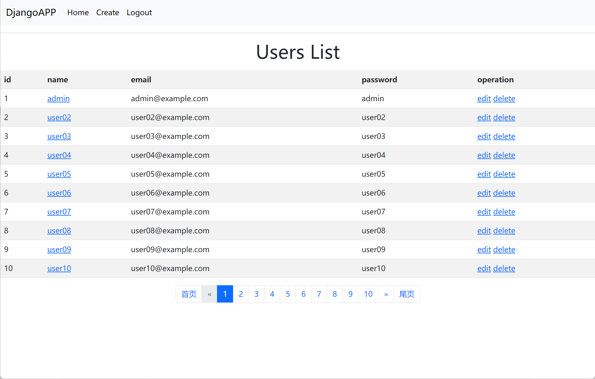
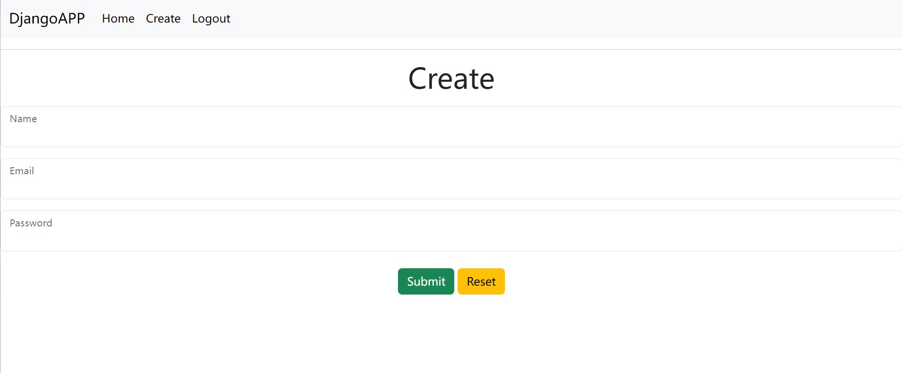
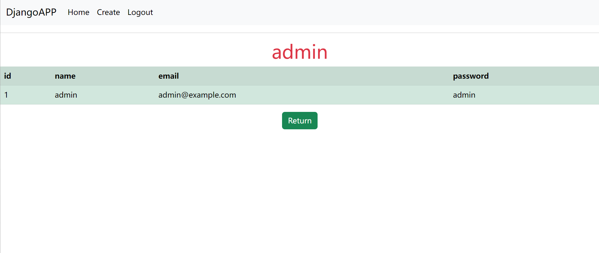
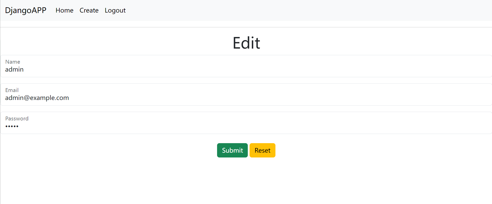

# Django-student
* [x] Support user information creation, deletion, modification, query
* [x] Login support user name and email authentication
* [x] Session retention support cookies and session mode
* [x] Display user information support paginator
  
# Requirement package
```
Django==4.2.2
mysqlclient==2.1.1
```
    
# Configuration  Virtual Environment
1. Install and create virtual environments
```
apt install python3-venv
python3 -m venv .\venv
```

2.  Run the following commands to activate the virtual environment in Linux
```
source .venv/bin/activate
```

# Project description
1. Download the project to the virtual environment directory
2. Before you can run the project, you need to configure MySQL. Create the App database and user connection information.

```
apt install mariadb-server

mysql
MariaDB [(none)]> create database App default charset utf8;
MariaDB [(none)]> grant all on App.* to 'admin'@'localhost' identified by "admin";
MariaDB [(none)]> flush privileges;
```
3. Install related requirement packages
```
pip3 install Django==4.2.2 mysqlclient==2.1.1

Note: Install mysqlclient unsuccessful, check whether the dependency is installed.
apt install mariadb-client libmariadb-dev libssl-dev libcrypto++-dev
```
4. Enter "webDemo" project directory and execute migration instructions to create databases and tables
```
python3 manage.py makemigrations
python3 manage.py migrate
```
5. Because the database is empty, there is no user during login. You need to insert a user information to log in to the page.
```
mysql App -e "insert into webApp_users values('1','admin','admin@example.com','admin');"

Note: If you want to see the pager in effect, you can batch create users.
for i in {01..99}; do mysql App -e "insert into webApp_users values('$i','user$i','user$i@example.com','user$i');"; done
```
6. Enter "webDemo" project directory to run the project
```
python3 manage.py runserver
```

# Test result



 
 