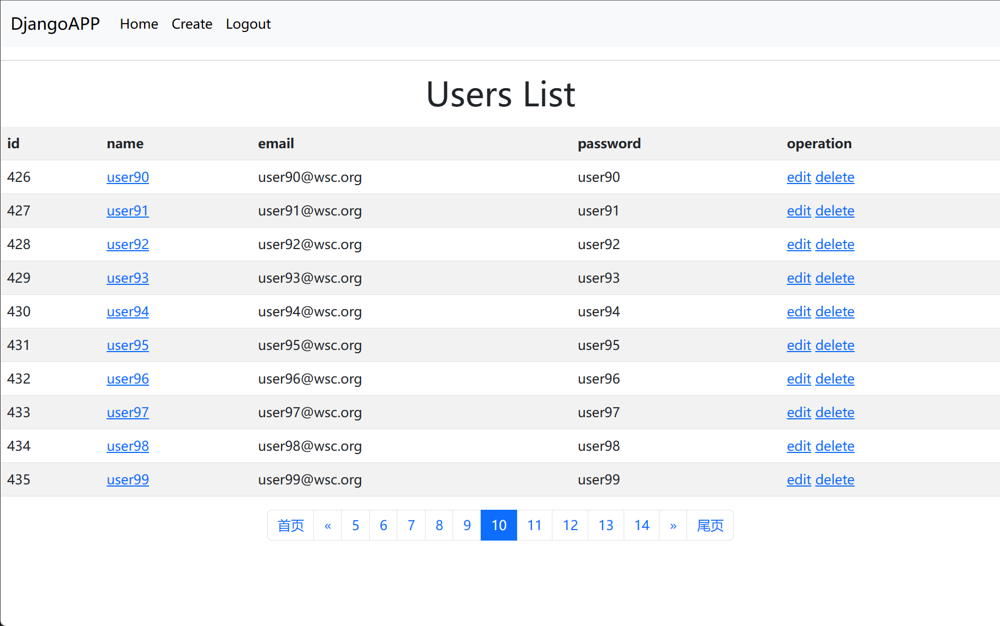
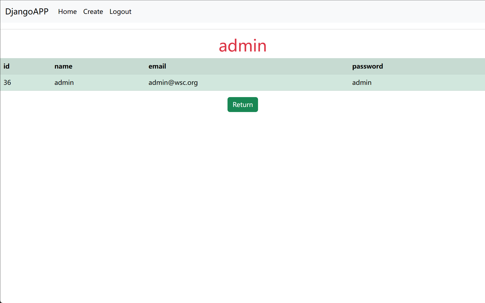
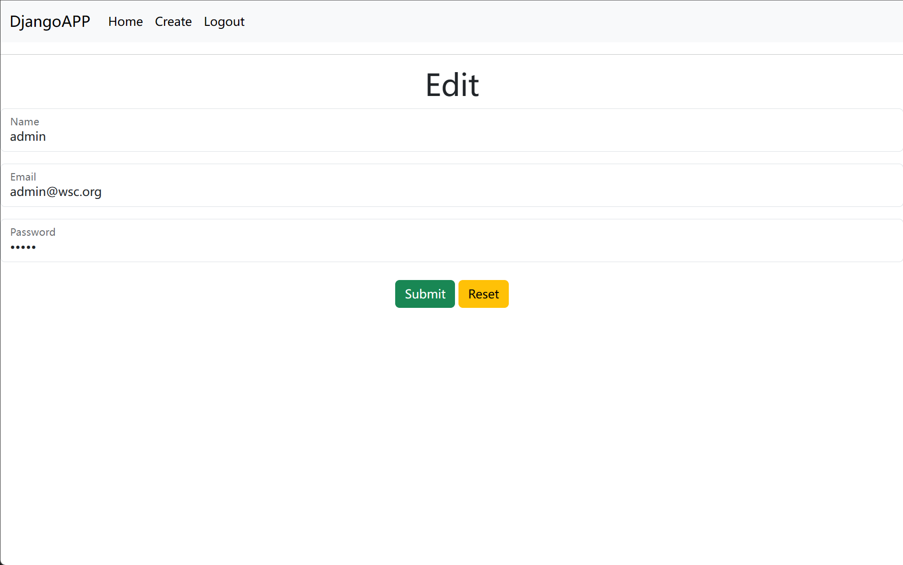

# Django-student
* [x] Support user information creation, deletion, modification, query
* [x] Login support user name and email authentication
* [x] Session retention support cookies and session mode
* [x] Display user information support paginator
  
# Requirement package
```
Django==4.2.2
mysqlclient==2.1.1
```
    
# Configuration  Virtual Environment
1. Install and create virtual environments
```
apt install python3-venv
python3 -m venv .\venv
```

2.  Run the following commands to activate the virtual environment in Linux
```
source .venv/bin/activate
```

# Project description
1. Download the project to the virtual environment directory
2. Before you can run the project, you need to configure MySQL. Create the App database and user connection information.

```
apt install mariadb-server

mysql
MariaDB [(none)]> create database App default charset utf8;
MariaDB [(none)]> grant all on App.* to 'admin'@'localhost' identified by "admin";
MariaDB [(none)]> flush privileges;
```
3. Install related requirement packages
```
pip3 install Django==4.2.2 mysqlclient==2.1.1

Note: Install mysqlclient unsuccessful, check whether the dependency is installed.
apt install mariadb-client 
apt install libmariadb-dev 
apt install libssl-dev 
apt install libcrypto++-dev
```
4. Enter "webDemo" project directory and execute migration instructions to create databases and tables
```
python3 manage.py makemigrations
python3 manage.py migrate
```
5. Enter "webDemo" project directory and Run "python3 manage.py runserver" command to run the project

# Test result


 
 
 